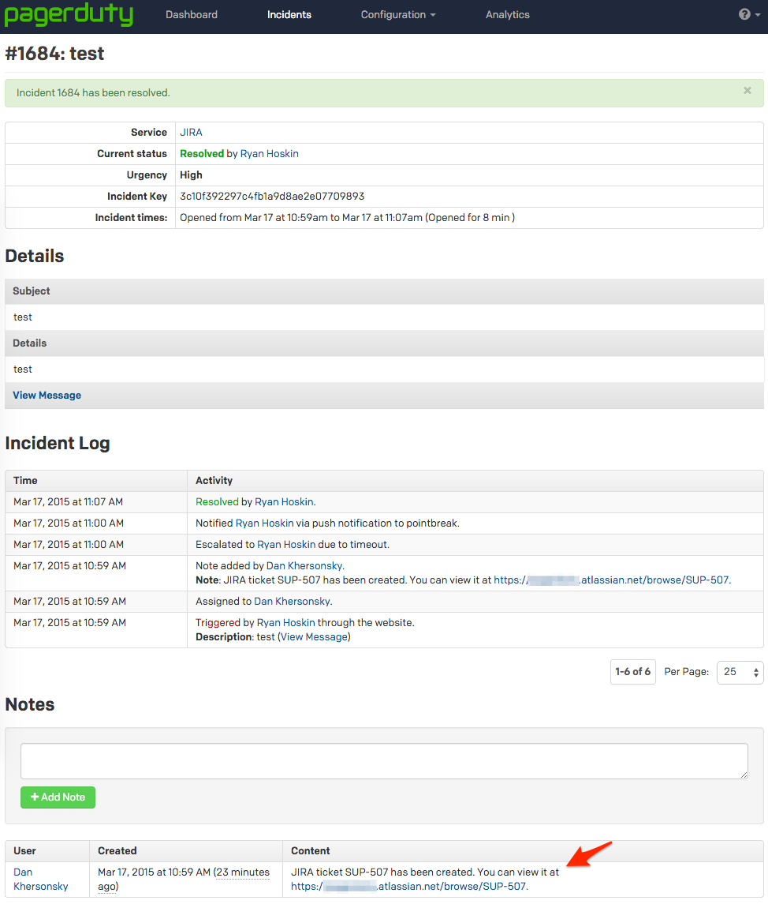
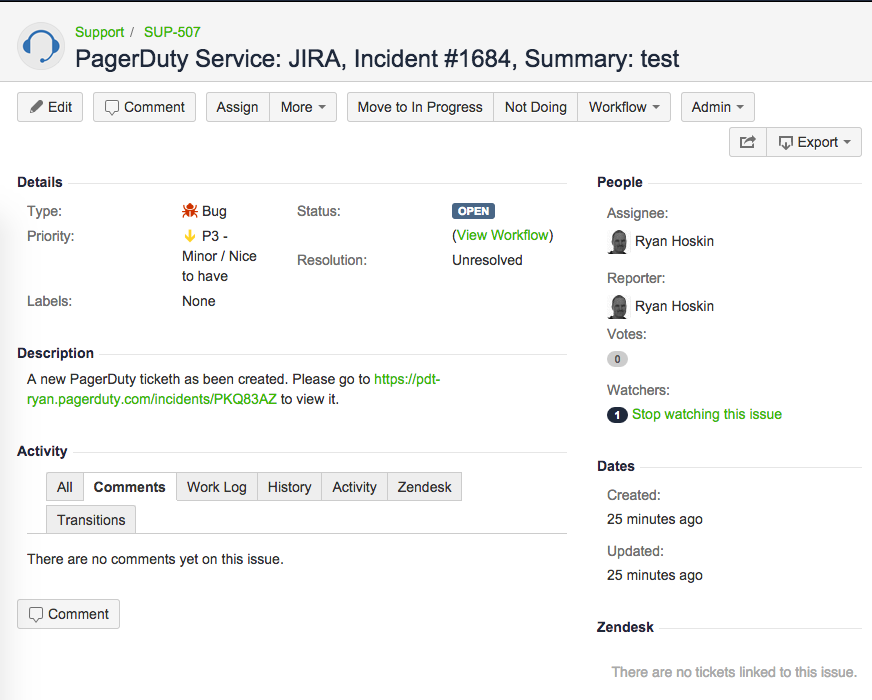

# pd2jira

Create `JIRA` tickets when a `PagerDuty` incident is triggered.  This is a small script that will translate PagerDuty's webhooks to become `JIRA` tickets.  You can host this yourself or deploy it to `Heroku`.  Either way, simply create a new webhook on your `PagerDuty` service(s) that points to the URL of the `PHP` script.  If using `Heroku`, you can fill out the necessary fields.  If you are hosting this yourself, you will need to populate the variables at the beginning of the `PHP` script.

## Getting Started & Documentation

For a full walkthrough on setting up the integration, please visit the integration guide [here](http://www.pagerduty.com/docs/guides/jira-integration-guide/)

## Screenshots

PagerDuty incident and corresponding note

JIRA ticket

## Copyright

Copyright (c) 2015-2017 Ryan Hoskin
